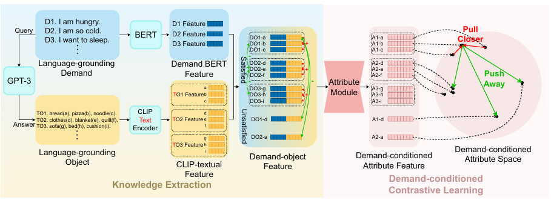
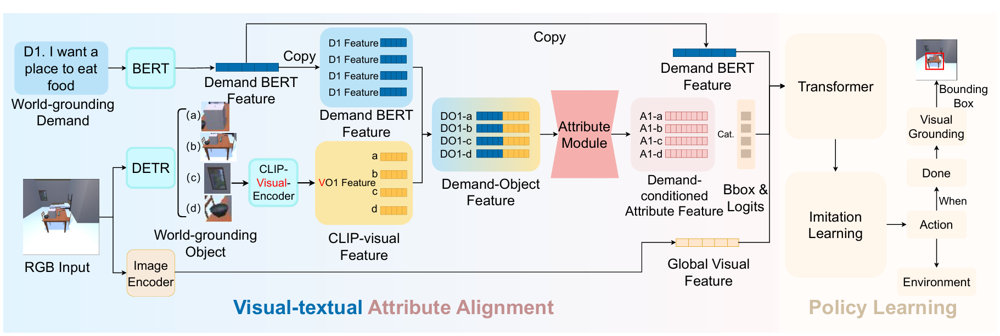

# 面向任务驱动导航的需求条件化物体属性空间学习

## 一、文章大致内容介绍

这篇论文的核心是让机器人（智能体）听懂人类的 “需求”，而不是纠结于 “具体物体名字”，在陌生环境里找到能满足需求的东西—— 比如你说 “我渴了”，机器人不用非要找 “矿泉水”，找 “茶”“苹果汁” 也能满足你。

物体满足需求的本质是其特定属性契合需求，因此论文核心思路是：提取物体的 “需求条件属性特征”，并将其与视觉特征对齐，辅助导航。

## 二、当前技术难点

### 2.1、文章要解决的问题

想像一个场景：你去朋友家做客，想喝水但不知道朋友家有没有矿泉水，或者朋友家根本没有矿泉水，但有茶。这时候如果让传统的 “找东西机器人”（对应论文里的 VON，视觉目标导航）来帮忙，它会失败 —— 因为传统机器人有两个死规矩：  
1、你必须明确说 “我要找矿泉水”（得知道物体名字）；  
2、环境里必须真的有 “矿泉水”（指定物体要存在）。  
但现实中，我们人类找东西根本不是这样：我们只说 “我渴了”（需求），然后自己找能解渴的东西，不管它叫什么名字、是不是我们最初想到的那个。  
论文就是要解决这个矛盾：打破传统机器人 “必须指定物体名字” 的限制，让机器人直接根据人类的 “需求” 找东西—— 这就是论文提出的新任务：DDN（Demand-Driven Navigation，需求驱动导航）。

### 2.2、DDN任务的挑战

> 1、不同环境的物体组成不同，且同一环境中物体类别可能随人类交互变化，导致同一需求对应的目标物体可能不同；  
> 2、需求与物体的多对多映射，要求智能体结合常识知识、人类偏好和场景接地信息，推理场景中可能存在的满足需求的物体及位置；  
> 3、智能体需从物体的视觉几何特征中判断其是否满足需求，而这一推理可能依赖物体功能，需智能体具备相关常识知识。  
> 核心挑战总结：如何利用常识知识、人类偏好和场景接地信息，解读需求指令并高效定位满足需求的物体。

## 三、相关工作

### 3.1 视觉导航（Visual Navigation）

视觉导航要求智能体利用视觉信息到达目标位置，主要包括：

> VON：寻找指定物体；  
> VLN：遵循分步自然语言指令导航；  
> 视觉音频导航（VAN）：结合视觉和音频信息导航。

VON 的两类方法：

> 封闭词汇 VON：目标类别预定义，常用语义地图、场景图等方法；  
> 开放词汇 VON：目标类别未知，常用预训练语言模型获取词嵌入向量，或用 CLIP 进行物体识别。

DDN 可视为 VON 与 VLN 的结合：以自然语言描述需求（类似 VLN），目标是寻找满足需求的物体（类似 VON）。但与 VLN 不同，DDN 仅提供高层需求指令，需智能体自主推理目标物体；与 VON 不同，DDN 不关注物体类别，而以 “人类需求” 为任务核心。

### 3.2 机器人领域的大型语言模型（LLMs in Robotics）

LLM 在文本分类、常识推理等语言任务中表现出色，越来越多研究尝试利用 LLM 的知识控制或辅助机器人完成任务：

> LM-Nav：结合 GPT-3、CLIP、ViNG 等预训练模型，实现无训练的户外导航；  
> SayCan：用 LLM 将高层人类指令转化为低层指令，结合预训练低层技能完成任务，但假设智能体能获取物体位置，且仅在单一场景实验；  
> PaLM-E：将视觉图像投影到语言语义空间，实现视觉感知，但控制局限于桌面级任务或有地图的场景级任务。

论文方法与上述不同：不直接用 LLM 进行指令推理，而是用 LLM 学习物体的属性特征，辅助无地图场景中的导航，同时用 LLM 生成数据集。

## 四、问题陈述

### 4.1 问题定义

DDN 任务中，智能体在无地图、未见过的环境中随机初始化位置和朝向，接收自然语言描述的需求指令（如 “我渴了”），需仅通过 RGB 图像传感器输入，寻找能满足需求的物体。

> $D$：需求指令集合；  
> $S$：可导航场景集合；  
> $O$：现实世界中所有物体类别的集合；  
> 判别器 $G:D×O→{0,1}$：

输入需求 $d∈D$ 和物体 $o∈O$，输出 1 表示物体满足需求，输出 0 则不满足。现实中由用户判断，实验中由 DDN 数据集实现。

### 4.2 任务流程

每个任务周期（episode）开始：智能体在场景 $s \in S$ 中以初始姿态 $p_0$ 初始化，接收需求指令 $d = \langle d_1, d_2, \dots, d_L \rangle$（$L$ 为指令长度，$d_i$ 为单个词元），指令中不包含具体物体名称；

**智能体动作空间：** 前进（MoveAhead）、右转（RotateRight）、左转（RotateLeft）、抬头（LookUp）、低头（LookDown）、结束（Done）；

**结束动作要求：** 智能体输出 RGB 图像中满足需求物体的边界框 $b$；

**成功条件（需同时满足）：**

1.  导航成功：视野中存在满足需求的物体，且智能体与物体的水平距离小于阈值 $c_{navi}$；
2.  选择成功：导航成功的前提下，输出边界框 $b$ 与真实边界框的交并比（IoU）大于阈值 $c_{sele}$；
3.  任务限制：每个周期最多 100 步完成。

## 五、需求驱动导航数据集（Demand-Driven Navigation Dataset）（模型训练阶段）

### 5.1 数据集核心：世界接地映射（world-grounding mappings WG 映射）

需求与物体的映射随环境变化，但训练智能体时需固定映射以判断选择成功，这种与特定环境绑定的映射称为 “世界接地映射（WG 映射）”。例如，ProcThor 数据集和 Replica 数据集的 WG 映射不同。  
实验假设：训练、验证、测试阶段，智能体无法访问环境中的物体类别元数据和 WG 映射（模拟现实场景），WG 映射集合构成 DDN 数据集。

### 5.2 数据集构建过程

1. 获取环境中的物体类别元数据；
2. 利用 GPT-3 建立需求指令与物体的 WG 映射 $F: D \to O_J$（$O_J$ 是 $O$ 的子集，如 $F("我渴了") = \{水, 茶, 苹果汁\}$）；  
   具体方式：通过提示工程告知 GPT-3 实验环境中可能存在的物体类别，让 GPT-3 判断这些物体能满足的需求，返回 “需求指令 + 满足该需求的物体” 组合；
3. 人工过滤与补充：GPT-3 生成的 WG 映射存在误差，需人工纠正错误、补充遗漏，最终生成约 2600 个 WG 映射。

WG 映射仅用于实验中判断 “选择成功”（即实现判别器 G），不提供给智能体作为导航依据。

## 六、需求驱动导航方法（Demand-Driven Navigation Method）

核心思路：满足同一需求的物体具有相似属性，属性与需求的关联是通用常识，可从 LLM 提取；将这种常识性的文本属性特征与视觉属性特征对齐，转化为 “需求条件属性特征”，降低导航策略学习复杂度（将多物体目标搜索转化为单属性目标搜索）。

方法分为三部分：文本属性特征学习、文本 - 视觉对齐、政策学习与视觉定位。

### 6.1 文本属性特征学习（Textual Attribute Feature Learning）

#### 6.1.1 知识提取（Knowledge Extraction）

**核心目标**

从 LLM 中提取常识，建立 “需求 - 物体” 映射，为学习属性特征提供数据。

**生成语言接地映射（language grounding mappings LG 映射）**

与 WG 映射不同，LG 映射不依赖具体环境，仅基于 LLM 的常识，适用于模型训练。具体过程：

- 用 GPT-3 生成大量需求指令（语言接地需求，LG 需求）；
- 询问 GPT-3 哪些物体能满足这些需求，得到语言接地物体（LG 物体）；
- LG 需求与 LG 物体的组合构成 LG 映射。

**世界接地(WG)与语言接地(LG) 核心对比**
| 维度 | WG（世界接地） | LG（语言接地） |
| ---- | ---- | ---- |
| 定义 | 与具体环境绑定的 “需求 - 物体” 映射（即 “在当前环境中，哪些物体能满足该需求”） | 基于通用常识的 “需求 - 物体” 映射（即 “从人类常识角度，哪些物体能满足该需求”，不依赖具体环境） |
| 来源 | 从实验环境（如 ProcThor 数据集）的物体元数据中提取，并通过人工校验得到（模拟 “当前环境的实际物体情况”） | 从大语言模型（如 GPT-3）中提取的常识知识（模拟 “人类普遍认知的需求 - 物体关联”） |
| 用途 | 仅用于实验评估：判断智能体是否选对了满足需求的物体（即实现论文中的判别器G），不提供给智能体用于导航 | 用于模型训练：为属性模块的对比学习提供 “需求 - 物体” 配对数据，帮助智能体学习 “满足同一需求的物体具有相似属性” |
| 示例（以“我饿了”为例） | 若当前环境只有 “面包、面条”，则 WG 映射为：“我饿了→{面包、面条}” | 从常识角度，LG 映射为：“我饿了→{面包、披萨、面条、汉堡}” |

**补充说明**

1.  核心差异：**WG强依赖当前环境**，物体集合受环境限制；**LG无环境约束**，物体集合源于通用常识
2.  核心作用：WG侧重「评估判断」，LG侧重「模型训练」，二者分工明确，共同支撑具身智能体的需求-物体匹配能力

**特征编码**

- 用 BERT 模型编码 LG 需求，得到 “需求 BERT 特征”；
- 用 CLIP 文本编码器编码 LG 物体，得到 “CLIP 文本特征”；
- 拼接 “需求 BERT 特征” 和 “CLIP 文本特征”，得到 “需求 - 物体特征”（记为 $DO\{X\}-\{Y\}$，$X$ 为需求标签，$Y$ 为物体标签）。

#### 6.1.2 需求条件对比学习（Demand-conditioned Contrastive Learning）

**目标**  
训练属性模块（Attribute Module），让满足同一需求的物体的属性特征更接近，不满足的更远离。

**正负样本定义（基于LG映射中的需求-物体满足关系）**

示例：

- 需求 D1（我饿了）：满足需求的物体→a（面包）、b（披萨）、c（面条）；不满足的物体→d（衣服）、e（毯子）、f（被子）、g（沙发）、h（床）、i（垫子）
- 需求 D2（我冷了）：满足需求的物体→d（衣服）、e（毯子）、f（被子）；不满足的物体→a（面包）、b（披萨）、c（面条）、g（沙发）、h（床）、i（垫子）
- 需求 D3（我想睡觉）：满足需求的物体→g（沙发）、h（床）、i（垫子）；不满足的物体→a（面包）、b（披萨）、c（面条）、d（衣服）、e（毯子）、f（被子）
- 需求 - 物体特征记为 $DO {需求标签}-{物体标签}$（比如 “$D1 + 面包$” 的特征是 $DO1-a$，“$D2 + 衣服$” 的特征是 $DO2-d$）

正样本对：满足同一需求的物体对应的“需求-物体特征”（如$DO1-a$与$DO1-b$）；

负样本对：

1.  同一需求下（同一DO），能满足的物体和不能满足的物体，它们的 “需求 - 物体特征” 是负样本对。（如$DO1-a$（我饿了 + 面包）与$DO1-d$（我饿了 + 衣服））；
2.  同一物体下，能满足的需求和不能满足的需求，对应的 “需求 - 物体特征” 是负样本对。（如$DO1-a$（我饿了 + 面包）与$DO2-a$（我冷了 + 面包））；
3.  需求不一样（DO不一样），物体也不一样（小写字母也不一样），不管这两个物体是否满足各自需求，它们的 “需求 - 物体特征” 都是负样本对。（如$DO1-a$与$DO2-c$）。

**模型与损失**  
属性模块采用6层Transformer编码器，使用InfoNCE损失训练，输出“需求条件属性特征”（记为$A\{X\}-\{Y\}$，$X$为需求标签，$Y$为物体标签），确保正样本对特征相近、负样本对特征疏远。

### 6.2 基于 CLIP 的文本 - 视觉对齐（Textual-Visual Alignment via CLIP）

目标：将语言层面的 “需求条件属性特征” 与视觉层面的物体特征对齐，让智能体能从图像中识别满足需求的物体（获取场景接地信息）。

步骤：

1. 导航过程中，用 DETR 模型分割视野中的物体块（世界接地物体，WG 物体）；
2. 用 CLIP 图像编码器将这些物体块投影到 CLIP 语义空间，得到 “CLIP 视觉特征”；
3. CLIP 的文本特征与视觉特征处于同一语义空间，因此可将 “需求 BERT 特征” 与 “CLIP 视觉特征” 拼接，作为已训练好的属性模块的输入；
4. 输出的 “需求条件属性特征” 既包含 LLM 的常识和人类偏好，又通过 CLIP 获得了场景接地信息。

### 6.3 政策学习与视觉定位模型（Policy Learning and Visual Grounding Model）

#### 6.3.1 政策学习（Policy Learning）

目标：训练智能体的导航策略，结合属性特征、需求特征和视觉特征，输出合理动作。

- 输入特征：需求条件属性特征、需求 BERT 特征、全局视觉特征（由预训练视觉 Transformer 编码 RGB 图像得到）、边界框和 logits；
- 模型结构：将上述特征输入 Transformer 编码器，再传入 Transformer 解码器，采用模仿学习训练；
- 训练数据：约 27000 条由 A \* 算法生成的轨迹。

#### 6.3.2 视觉定位模型（VG 模型）

目标：任务周期结束时，准确框出视野中满足需求的物体。

- 模型结构：基于 Transformer 编码器的分类器；
- 输入特征：DETR 输出的 top-k 物体块的最后一层特征、ResNet-18 编码的全局图像特征、需求 BERT 特征、CLS token；
- 输出：判断物体是否满足需求，输出对应的边界框。
